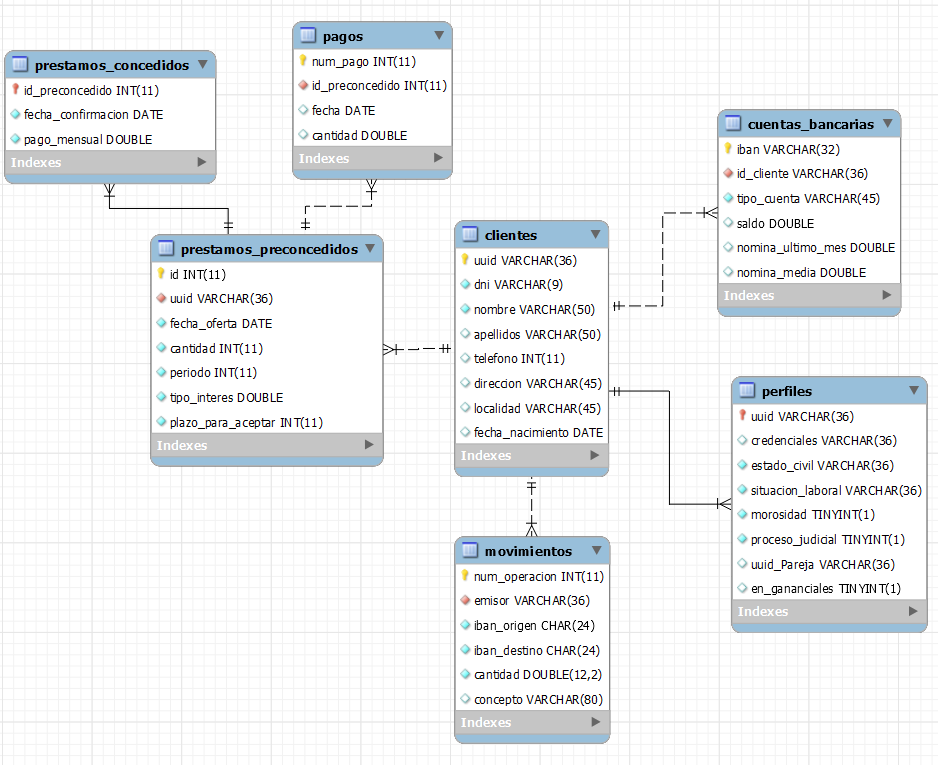
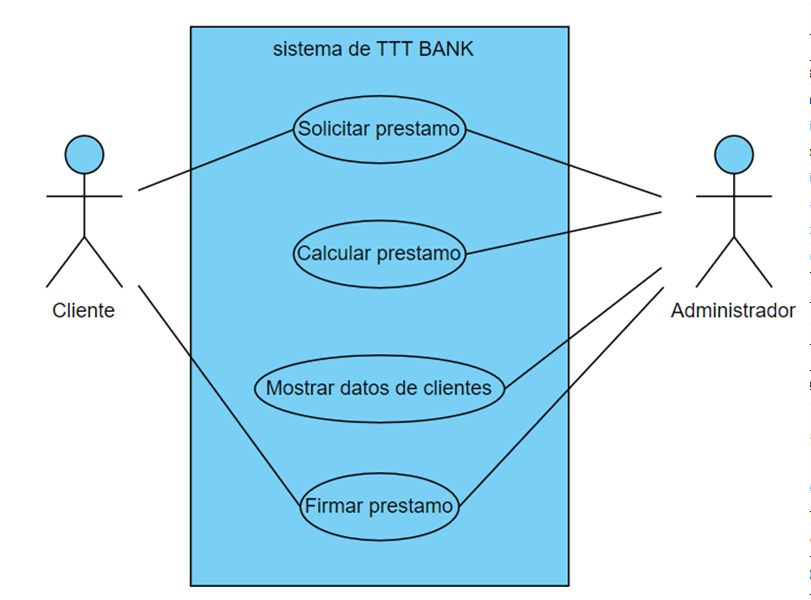

## Dia 1

|David Prado |Coordinador|
| :- | :- |
|David Llanillo|Diseñar base de datos|
|Aymane Laaziri|Creación del proyecto de Github|
|Asier |Diseñar base de datos|
|Angel|Creación del proyecto de Github|

## Actividades a realizar 
- Asignar las tareas a cada uno (David Prado)
- Crear el proyecto en github (David Prado)
- Diseñar la base de datos (David Prado)
- Implementar la base de datos (David Llanillo y Aymane)
- Crear la máquina de producción (Asier)
- Diseñar la página web  (David Llanillo y Aymane)

Actividades realizadas:

- Asignar las tareas a cada uno (David Prado)
- Crear el proyecto en github (David Prado)
- Diseñar la base de datos (David Llanio , Aymane Laaziri)
- Crear la máquina de producción (Asier)

## Dia 2

|David Llanillo|Implementar las bases de datos|
| :- | :- |
|Aymane Laaziri|Implementar las bases de datos|
## Actividades a realizar 
- Diseñar e Implementar la base de datos (David Llanillo y Aymane)

Actividades realizadas

- Diseñar e Implementar la base de datos (David Llanio , Aymane Laaziri)

## Dia 3

|David Prado |Coordinador|
| :- | :- |
|David Llanillo|Diseñar base de datos|
|Aymane Laaziri|Creación de la web|
|Asier |Creación de la web|
|Angel|desarrollar el programa en java|

## Actividades a realizar 
- Asignar las tareas a cada uno (David Prado)
- Implementar la base de datos (David Llanillo y David Prado)
- Hacer la página web (Asier y Aymane)
- Empezar a desarrollar el programa
- hacer diagramas de clases
## Actividades realizadas
- Página web completa
- Base datos implementada
- Empezamos a desarrollar el programa
- todos los diagramas de clases hechos
# Diagrama de bases de datos

Diagrama del tratamiento del préstamo

Diagrama de Casos de uso

 

**Caso de uso Solicitar préstamo**

• Actores involucrados: administrador y cliente.

• Precondición: El cliente debe tener una cuenta en el banco.

• Flujo básico:

1.Un cliente acude a una sucursal bancaria a pedir un préstamo.

2.El administrador del programa del banco introduce el dni del cliente y solicita el préstamo,

en caso de que cumpla las condiciones se le añadirá a una lista de préstamos preconcedidos y

se le mostrará la cantidad preconcedida.

 

• Caminos alternativos:

- Si el cliente no tiene cuenta en el banco no podrá acceder a un préstamo.

- Si en el paso 2 no cumple con los requisitos, se muestra un mensaje de que el usuario no es apto para

préstamo, por lo que se le denegará el mismo.

 

**Caso de uso Calcular préstamo**

• Actores involucrados: administrador.

• Precondición: El cliente debe tener una cuenta en el banco y haber solicitado préstamo.

• Flujo básico:

1.El administrador ,mediante la aplicación, calculará los préstamos de todos los clientes que hayan solicitado uno.

2.Generar un informe con los préstamos calculados .

 

**Caso de uso Mostrar datos de clientes**

• Actores involucrados: administrador y cliente.

• Precondición: El cliente debe tener una cuenta en el banco

• Flujo básico:

1.El administrador del banco usará la aplicación para que le muestre la lista de todos los clientes con sus datos.

 

**Caso de uso Firmar préstamo**

• Actores involucrados: administrador y cliente.

• Precondición: El cliente debe tener una cuenta en el banco y haber solicitado un préstamo.

• Flujo básico:

1.El administrador introducirá el dni del cliente en el programa.

2.El cliente debe comunicarle al administrador cual es el préstamo  preconcedido que desea firmar.

3.El administrador del banco seleccionará ese préstamo preconcedido y le dará a firmar, apareciendo así

en la lista de préstamos concedidos al cliente.

## Dia 4 

|David Prado|Desarrollar el programa en java|
| :- | :- |
|David Llanillo|Desarrollar el programa en java|
|Aymane Laaziri|Desarrollar el programa en java|

## Actividades a realizar
- Seguir con el desarrollo del programa
- Realizar el método para a través de un cliente sacar su préstamos

Actividades realizadas

- El método para sacar los préstamos terminado

## Dia 5

|David Prado |Desarrollar el programa en java|
| :- | :- |
|David Llanillo|Desarrollar el programa en java|
|Aymane Laaziri|Desarrollar el programa en java|
|Asier |Desarrollar el programa en java|
|Angel|Desarrollar el programa en java|

## Dia 6

|David Prado |Realizar la presentación y ultimas modificaciones del programa de java|
| :- | :- |
|David Llanillo|Realizar la presentación|
|Aymane Laaziri|Realizar la presentación|
|Asier |Finalizar el cliente-servidor, crear el Markdown y realizar la presentación|
|Angel|Realizar la presentación|
